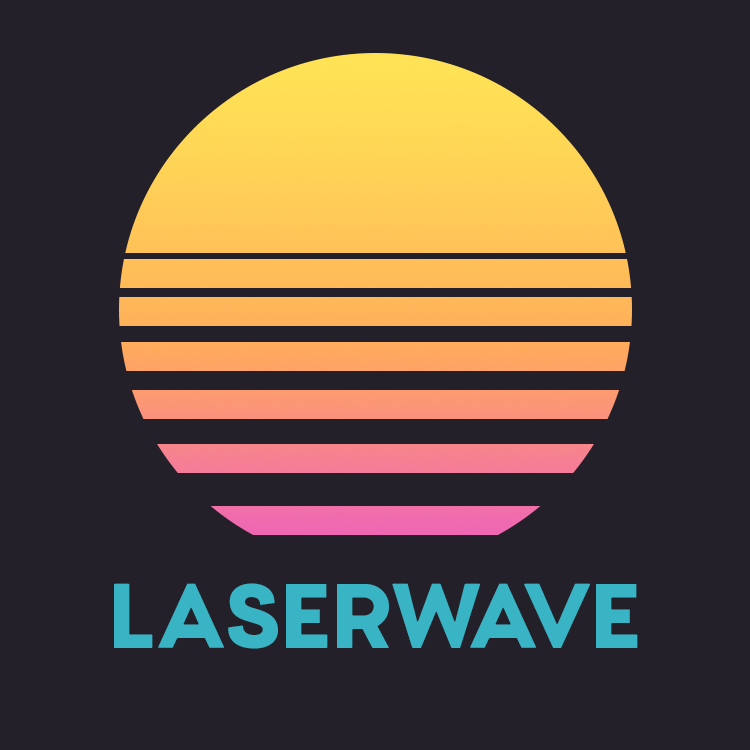

  

<!--
🎈 To give users an idea of what your theme looks like, it's a great idea to show big, beautiful screenshots of your theme in action:
-->

**LaserWave** provides a fun, metro palette:

<!--
🎈 If your extension provides multiple variations, don't forget to show those too!
-->

LaserWave also offers a high contrast alternative:

## Currently supports:

- Typescript & Javascript
- JSX & TSX
- Markdown
- JSON
- Yaml
- Toml
- Makefile
- Shell
- HTML
- SCSS/CSS/SASS
- SQL
- INI

## Acknowledgements

LaserWave is based on the _Original LaserWave_ by [Jaredk3nt](https://github.com/Jaredk3nt/laserwave).
